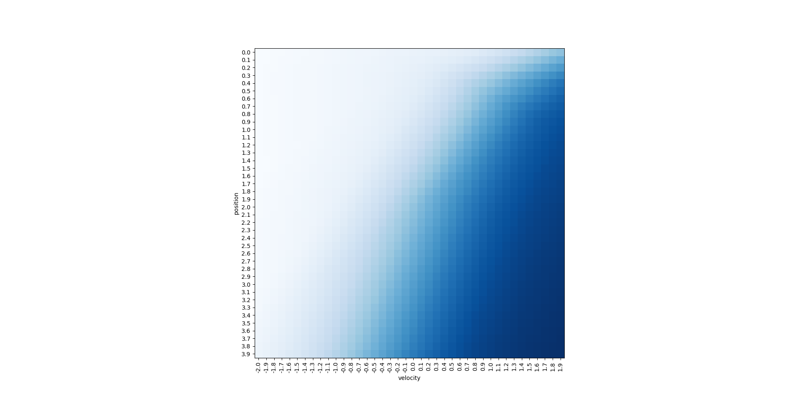

# Mujoco Wall Environment

Toy example, that I wrote to learn a bit of Mujoco and experiment with creating custom RL environments.\
And also while doing it I implemented own version of Vanilla Policy Gradient algorithm.

### How is it working?
Block on simulation symbolizes car :) which should get to the wall as quickly as possible but it is penalized for the impact speed.\
Below video from one of the environments with successfully trained agent:

https://github.com/user-attachments/assets/cfae33c2-68e6-409f-b470-9c474189fe18

And some example policy map:

